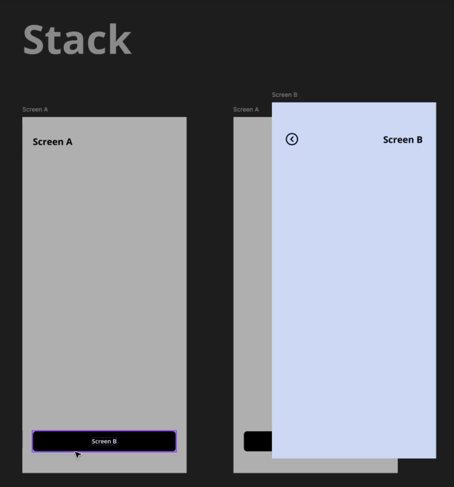
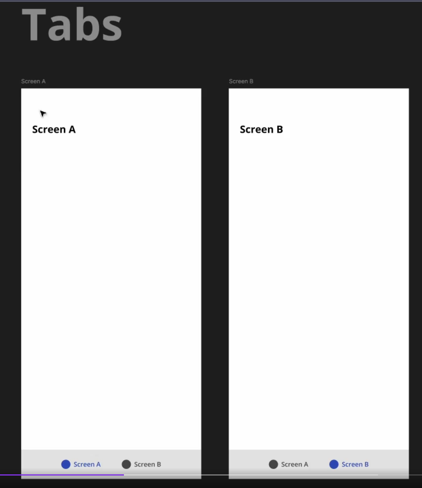
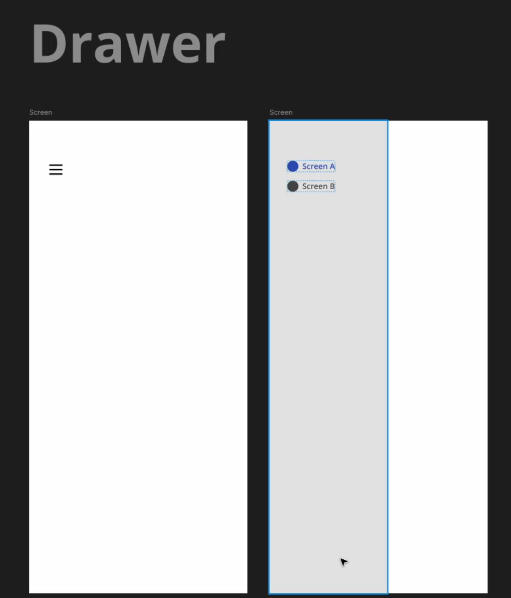

# 📚 Navegação em Aplicações React Native com React Navigation

## 🧠 Introdução

Em aplicações mobile modernas, **navegação entre telas** é um dos elementos mais importantes da experiência do usuário. Assim como em um site, onde o usuário navega entre páginas, em aplicativos mobile o usuário se movimenta entre **telas**.

No ecossistema **React Native**, a biblioteca mais utilizada para gerenciar navegação é o **React Navigation**. Ela fornece uma estrutura poderosa para controlar como os usuários transitam entre diferentes partes da aplicação.

Nesta aula vamos compreender:

* O que é **navegação em aplicativos mobile**
* Como funciona o **React Navigation**
* O conceito de **rotas**
* Os principais **tipos de navegação**

  * **Stack Navigation**
  * **Bottom Tabs Navigation**
  * **Drawer Navigation**

Ao final, você terá uma compreensão sólida de **como estruturar a navegação em aplicações React Native**.

---

## 📖 Conceitos Fundamentais

### Navegação em aplicativos mobile

Navegação é o processo que permite que o usuário **se mova entre diferentes telas dentro de um aplicativo**.

Por exemplo:

* sair da tela inicial
* abrir a tela de detalhes de um produto
* acessar configurações
* voltar para a tela anterior

Esse fluxo é controlado por um **sistema de rotas**.

---

### O que são rotas

No contexto do React Navigation, **rotas representam telas da aplicação**.

Cada tela possui um **identificador**, que funciona como um caminho para acessá-la.

Exemplo conceitual:

* `/home` → tela inicial
* `/product-details` → detalhes do produto
* `/profile` → perfil do usuário

Quando o usuário interage com o aplicativo (clicando em botões, menus ou abas), o sistema de navegação **muda a rota ativa**, exibindo outra tela.

---

### O React Navigation

O **React Navigation** é uma biblioteca que implementa esse sistema de rotas dentro do React Native.

Ele permite:

* navegar entre telas
* passar parâmetros entre telas
* controlar histórico de navegação
* organizar diferentes estruturas de navegação

Além disso, ele oferece **estratégias diferentes de navegação**, adaptadas a diferentes tipos de interface.

As principais são:

* **Stack Navigation**
* **Tabs Navigation**
* **Drawer Navigation**

Cada uma delas resolve **problemas diferentes de usabilidade**.

---

## 🔎 Explicação Detalhada

### 1️⃣ Stack Navigation

### 📸 Preview



A **Stack Navigation** funciona baseada no conceito de **pilha (stack)**.

Nesse modelo, cada nova tela aberta é **empilhada sobre a tela anterior**.

#### Funcionamento

Imagine o seguinte fluxo:

1. O usuário está na **Tela A**
2. Ele pressiona um botão para abrir a **Tela B**
3. A **Tela B aparece sobre a Tela A**

Visualmente:

```
Tela B
------
Tela A
```

A Tela A **continua existindo**, mas está atrás da Tela B.

Quando o usuário fecha a Tela B:

* ela **é removida da pilha**
* a Tela A volta a ser exibida

Importante entender:

> O aplicativo não "volta" para a Tela A.
> Na verdade, **a Tela A nunca deixou de existir**.

A Tela B apenas estava **na frente dela**.

#### Características da Stack Navigation

* navegação em **pilha**
* telas são **empilhadas umas sobre as outras**
* muito utilizada em **fluxos sequenciais**

#### Exemplos de uso

* abrir **detalhes de um produto**
* abrir **perfil de usuário**
* telas de **formulários**
* fluxo de **checkout**

---

### 2️⃣ Bottom Tabs Navigation

### 📸 Preview



A **Bottom Tabs Navigation** utiliza uma **barra de navegação fixa na parte inferior da tela**.

Nessa barra ficam disponíveis **rotas principais do aplicativo**.

Cada item da barra representa **uma tela**.

#### Estrutura visual

```
------------------------
|                      |
|      Conteúdo        |
|                      |
------------------------
| Home | Search | User |
------------------------
```

Quando o usuário toca em uma aba:

* o conteúdo da tela muda
* a aba selecionada é destacada visualmente

#### Características da Tabs Navigation

* menu **fixo na parte inferior**
* acesso rápido às principais áreas do aplicativo
* alternância instantânea entre telas

#### Exemplo real

Aplicativos como **Instagram** utilizam esse tipo de navegação.

Exemplo de abas comuns:

* Home
* Explorar
* Reels
* Notificações
* Perfil

Essas opções permanecem **sempre visíveis ao usuário**, facilitando a navegação.

#### Quando utilizar Tabs

Esse modelo é ideal quando:

* existem **poucas rotas principais**
* você quer **acesso rápido às telas principais**
* deseja manter **navegação sempre visível**

---

### 3️⃣ Drawer Navigation

### 📸 Preview



A **Drawer Navigation** funciona como um **menu lateral deslizante**.

Esse menu se comporta como uma **gaveta**, por isso o nome *drawer*.

#### Funcionamento

Inicialmente o menu fica oculto.

Ele pode ser aberto de duas formas:

* clicando em um **botão de menu**
* realizando um **gesto de arrastar da lateral da tela**

Quando aberto, ele exibe uma lista de rotas.

Exemplo visual:

```
--------------------------
|   MENU                  |
|                         |
|  Home                   |
|  Profile                |
|  Settings               |
|  Notifications          |
|  Help                   |
|                         |
--------------------------
```

O usuário pode então selecionar a tela desejada.

#### Características da Drawer Navigation

* menu **vertical**
* ocupa a **altura inteira do dispositivo**
* pode conter **muitas opções de navegação**

#### Vantagem principal

Esse modelo é ideal quando o aplicativo possui **muitas rotas**.

Se tentássemos colocar muitas rotas em **Bottom Tabs**, elas não caberiam na tela.

Já no **Drawer**, é possível até adicionar **scroll** para acessar todas as opções.

#### Quando usar Drawer

Use esse modelo quando:

* o aplicativo possui **muitas opções de navegação**
* você quer manter a interface **limpa**
* precisa de um **menu completo de seções**

---

## 💡 Exemplos práticos

### Exemplo 1 — Stack Navigation

Aplicativo de e-commerce:

1. Tela inicial com lista de produtos
2. Usuário clica em um produto
3. Abre a tela de **detalhes do produto**

Fluxo:

```
Home → ProductDetails
```

A tela de detalhes é empilhada sobre a tela inicial.

---

### Exemplo 2 — Tabs Navigation

Aplicativo de rede social:

Abas inferiores:

* Feed
* Explorar
* Criar Post
* Notificações
* Perfil

O usuário alterna rapidamente entre essas áreas.

---

### Exemplo 3 — Drawer Navigation

Aplicativo corporativo com muitas seções:

Menu lateral:

* Dashboard
* Clientes
* Relatórios
* Configurações
* Ajuda
* Suporte

Como são muitas opções, o **menu lateral é mais adequado**.

---

## ⚠️ Pontos importantes

Alguns pontos essenciais sobre navegação no React Native:

* **React Navigation é a biblioteca mais usada para navegação**
* Navegação é baseada em **rotas**
* Existem diferentes **estratégias de navegação**
* Cada estratégia resolve **problemas diferentes de interface**

Resumo dos tipos:

| Tipo   | Característica              |
| ------ | --------------------------- |
| Stack  | Navegação em pilha          |
| Tabs   | Menu fixo na parte inferior |
| Drawer | Menu lateral deslizante     |

---

## 📝 Resumo do conteúdo

Nesta aula aprendemos que:

* Navegação permite ao usuário **se mover entre telas**.
* O **React Navigation** é a principal biblioteca de navegação no React Native.
* A navegação é estruturada através de **rotas**.
* Existem três estratégias principais:

1️⃣ **Stack Navigation**
Telas são empilhadas umas sobre as outras.

2️⃣ **Bottom Tabs Navigation**
Menu fixo na parte inferior com acesso rápido às rotas principais.

3️⃣ **Drawer Navigation**
Menu lateral deslizante ideal para muitas opções de navegação.

Cada estratégia deve ser escolhida **de acordo com o tipo de experiência desejada no aplicativo**.

---

## 🎯 Perguntas para revisão

1. O que é navegação em aplicações React Native?
2. Qual é o papel do **React Navigation** em um aplicativo?
3. Como funciona o modelo de **Stack Navigation**?
4. Em quais situações é recomendado utilizar **Bottom Tabs**?
5. Quando a **Drawer Navigation** se torna a melhor escolha?

---

## 📌 Conclusão

A navegação é um dos pilares fundamentais no desenvolvimento de aplicações mobile. Uma navegação bem planejada melhora significativamente a **experiência do usuário** e a **organização do aplicativo**.

O **React Navigation** oferece ferramentas flexíveis para implementar diferentes estratégias de navegação, permitindo que desenvolvedores escolham a abordagem mais adequada para cada tipo de aplicação.

Compreender as diferenças entre **Stack**, **Tabs** e **Drawer** é essencial para projetar interfaces intuitivas e eficientes, garantindo que os usuários consigam navegar pelo aplicativo de forma natural e fluida.

## 🔗 Links úteis

- [React Navigation](https://reactnavigation.org/) — Biblioteca para gerenciamento de navegação em aplicações React Native.